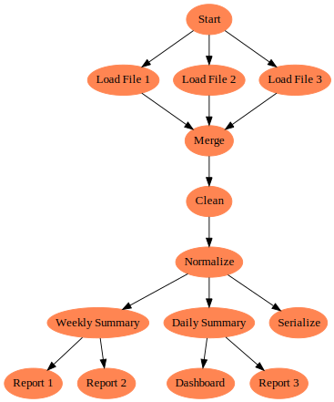
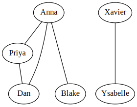
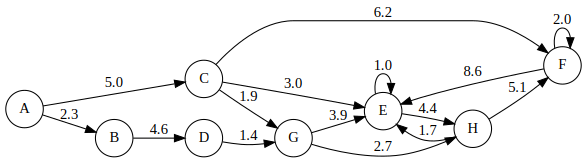
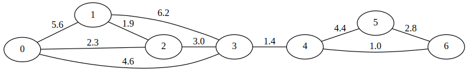
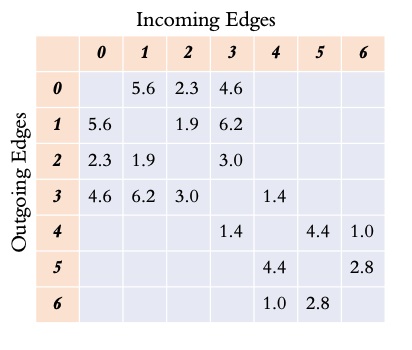
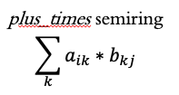
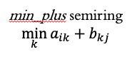
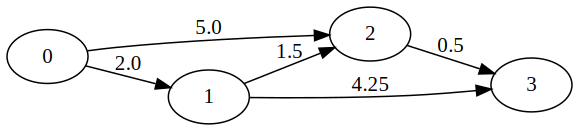
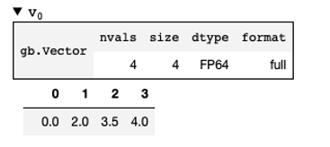

.. _primer:

GraphBLAS Primer
================

This primer covers:

  - :ref:`what-is-a-graph`
  - :ref:`common-graph-storage`
  - :ref:`pagerank-using-linear-algebra`
  - :ref:`introduction-to-semirings`
  - :ref:`sssp-in-python-graphblas`
  - :ref:`summary`

.. _what-is-a-graph:

What is a graph?
----------------

A graph is a set of nodes (also called vertices) that are connected with edges.

When the edges have an associated direction (i.e. arrow), the graph is *directed*.

The following graph is a task graph, meaning subsequent tasks can only be started
when all previous dependencies are completed.

When edges do not have a defined direction, the graph is *undirected*.

In the following social network, it is assumed friendships are mutual,
so direction is unnecessary when indicating friendships as edges.

Notice that the graph is not fully connected. There is no requirement for all nodes in a
graph to be reachable from any other node.

Edges can have weights associated them. The meaning of the weight depends on the graph.
For a road network, it might represent the travel time based on the length of road and
the posted speed limit.

This graph shows the complexity that can occur in a graph. Self-edges have the same node
as their start and end point.

.. _common-graph-storage:

Common ways to store a graph
----------------------------

The most common way to store a graph is as an edge list, containing the ``(start_node, end_node, weight)``.

The following graph and its edge list are shown below.

::

    (0, 1, 5.6)
    (0, 2, 2.3)
    (0, 3, 4.6)
    (1, 2, 1.9)
    (1, 3, 6.2)
    (2, 3, 3.0)
    (3, 4, 1.4)
    (4, 5, 4.4)
    (4, 6, 1.0)
    (5, 6, 2.8)

Notice that each edge is only listed once. An edge list would need to indicate whether
these are directed edges or undirected.

While edge lists are easy to create, they are not ideal for performance. Finding all the
edges connected to node 3 requires a full scan of the list. For this reason, other formats
exist which make common operations more performant.

For example, networkx uses a dict of dicts to store graphs, allowing easy query of each node's
outgoing edges. This requires doubling the memory usage in the case of undirected graphs, but
makes for faster graph algorithms.

.. code-block:: python

    # networkx-style storage of an undirected graph
    G = {
        0: {1: {"weight": 5.6}, 2: {"weight": 2.3}, 3: {"weight": 4.6}},
        1: {0: {"weight": 5.6}, 2: {"weight": 1.9}, 3: {"weight": 6.2}},
        2: {0: {"weight": 2.3}, 1: {"weight": 1.9}, 3: {"weight": 3.0}},
        3: {0: {"weight": 4.6}, 1: {"weight": 6.2}, 2: {"weight": 3.0}, 4: {"weight": 1.4}},
        4: {3: {"weight": 1.4}, 5: {"weight": 4.4}, 6: {"weight": 1.0}},
        5: {4: {"weight": 4.4}, 6: {"weight": 2.8}},
        6: {4: {"weight": 1.0}, 5: {"weight": 2.8}},
    }

An alternative way to store a graph is as an adjacency matrix. Each node becomes both a row
and a column in the matrix. Cells in the matrix are filled in with the edge weight (if it exists).
This naturally creates a square sparse matrix.

Reading along a row, the outgoing edges are shown, while reading down a column show the
incoming edges to a node.

In the case of an undirected graph, the graph is symmetric, so the property may not be apparent
for this example.

While the adjacency matrix is a nice format to work with conceptually, it would be very inefficient
to store the full matrix as a 2-dimensional dense array. Instead, formats exist to efficiently store
only the present values.

Various formats exist for efficiently storing only the present values. Examples include
Compressed Sparse Row (CSR) as well as hypersparse CSR format (also called double-compressed
sparse row). These are very good at iterating over the sparse matrix in a row-wise manner.
Similar formats exist which are column-oriented.

.. _pagerank-using-linear-algebra:

Pagerank using Linear Algebra
-----------------------------

Once we enter the realm of sparse matrices for storing graphs, the natural question is whether
the field of linear algebra can be used to do anything useful with the graph representation.

Let's look at a motivating example with Pagerank, which is one of the most famous graph analysis
metrics in the area of web search.

Pagerank takes the weight of a given node and distributes it to each of its connecting nodes in
an iterative manner until the process converges. The final value of each node is the pagerank
and will generally indicate the importance of that node in the overall graph.

This is a simplified version of the networkx pagerank algorithm. The outermost for-loop is for
the overall convergence of the algorithm. The two inner for-loops iterate over each edge of each
node. This is rather slow because of how Python handles for-loops.

.. code-block:: python

    for _ in range(max_iter):
        xlast = x
        x = dict.fromkeys(xlast.keys(), 0)
        for n in x:
            for _, nbr, wt in W.edges(n, data=weight):
                x[nbr] += alpha * xlast[n] * wt
        # check convergence, l1 norm
        err = sum(abs(x[n] - xlast[n]) for n in x)
        if err < N * tol:
            return x
    raise nx.PowerIterationFailedConvergence(max_iter)

Pagerank has a very natural representation using linear algebra. The inner for-loops are simply
performing a matrix multiplication with a vector.

Here is the same algorithm using scipy.sparse matrix and vector. It is both simpler to read and
also much faster, as the matrix multiplication can be dispatched to scipy.

.. code-block:: python

    for _ in range(max_iter):
        xlast = x
        x = alpha * (x @ A)
        # check convergence, l1 norm
        err = np.absolute(x - xlast).sum()
        if err < N * tol:
            return dict(zip(nodelist, map(float, x)))
    raise nx.PowerIterationFailedConvergence(max_iter)

.. _introduction-to-semirings:

Introduction to semirings
-------------------------

With a sparse vector representing the current value of each node and a sparse adjacency matrix
representing the edges of the graph, a Vector-Matrix multiplication is equivalent to performing
one step of a Breadth-First Search (BFS).

The value of each node is multiplied by the weight of each edge, and those new values are summed
together by the receiving node. In this way, the initial node's value spreads out throughout the graph
first to the one-hop neighbors and then to the two-hop neighbors, etc.

This idea of propagating values to neighbors is fundamental to many graph algorithms. However, rather
than using the standard matrix multiplication operators of multiplying elements together and adding
the results, other operators are used in the same manner. These are called **semirings**.

The "standard" way of performing matrix multiplication is using the *plus_times* semiring.

An alternative semiring is the *min_plus* semiring.

Conceptually, the *min_plus* semiring takes a node's value, *adds* it to the edge weight, and when
collecting values at the receiving node, it takes the smallest value.

Why is this useful?

Because doing a repeated BFS with the *min_plus* semiring will compute the Single-Source
Shortest Path (SSSP) algorithm using linear algebra.

.. _sssp-in-python-graphblas:

SSSP in python-graphblas
------------------------

Below is the python-graphblas algorithm to compute Single-Source Shortest Path for this graph, starting from
node 0.

.. code-block:: python

    from graphblas import op, semiring, Matrix, Vector

    # Create the graph and starting vector
    start_node = 0
    G = Matrix.from_coo(
        [0, 0, 1, 1, 2],
        [1, 2, 2, 3, 3],
        [2.0, 5.0, 1.5, 4.25, 0.5],
        nrows=4,
        ncols=4
    )
    v = Vector.from_coo([start_node], [0.0], size=4)

    # Compute SSSP
    while True:
        w = v.dup()

        # Perform a BFS step using min_plus semiring
        # Accumulate into v using the `min` function
        v(op.min) << semiring.min_plus(v @ G)

        # The algorithm is converged once v stops changing
        if v.isequal(w):
            break

The result finds the shortest path from node 0 -> node 3 has a path length of 4.0, which
goes through nodes 1 and 2. It is not the most direct, but it is the shortest.

Other algorithms exist to identify the parent of each node when walking back to the source node,
but this algorithm only computes the shortest path length.

.. _summary:

Summary
-------

This primer has been a short introduction to graphs, representing graphs as sparse adjacency matrices,
and showing that linear algebra can be used to compute graph algorithms with the expanded concept
of semirings.

This is a somewhat new field of research, so many academic papers and talks are being given every year.
`Graphblas.org <https://graphblas.org>`_ remains the best source for keeping up-to-date with the latest
developments in this area.

Many people will benefit from faster graph algorithms written in GraphBLAS, but for those that want
to play around with the full power of GraphBLAS, there is no substitute for getting your hands dirty
in code. Read the :ref:`user_guide` to learn more.
