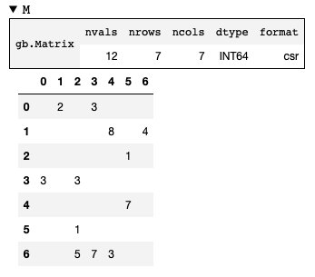
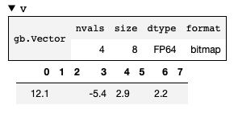
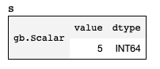

Collections
===========

python-graphblas has three collections for holding data: **Matrix**, **Vector**, and **Scalar**.
Each is a sparse container, meaning elements may be empty. Each collection has a single data type
and a defined shape based on the number of dimensions.

Matrix
------

A **Matrix** is a 2-dimensional sparse array.

.. code-block:: python

    M = gb.Matrix.from_coo(
        [3, 0, 3, 5, 6, 0, 6, 1, 6, 2, 4, 1],
        [0, 1, 2, 2, 2, 3, 3, 4, 4, 5, 5, 6],
        [3, 2, 3, 1, 5, 3, 7, 8, 3, 1, 7, 4],
        nrows=7, ncols=7
    )

Viewing the ``__repr__`` for ``M`` in a notebook will look like the following, although
the name, dtype, and format might be different than what is shown here.

Here are common attributes that can be accessed on the Matrix object.

.. code-block:: python

    >>> M.dtype
    INT64
    >>> M.nrows
    7
    >>> M.ncols
    7
    >>> M.shape
    (7, 7)
    >>> M.nvals
    12
    >>> M.ndim
    2

Vector
------

A **Vector** is a 1-dimensional sparse array.

.. code-block:: python

    v = gb.Vector.from_coo([0, 3, 4, 6], [12.1, -5.4, 2.9, 2.2], size=8)

Viewing the ``__repr__`` for ``v`` in a notebook will look like the following, although
the name, dtype, and format might be different than what is shown here.

Here are common attributes that can be accessed on the Vector object.

.. code-block:: python

    >>> v.dtype
    FP64
    >>> v.size
    8
    >>> v.shape
    (8,)
    >>> v.nvals
    4
    >>> v.ndim
    1

Scalar
------

A **Scalar** is a 0-dimensional sparse array. It either contains a single value
or no value.

.. code-block:: python

    s = gb.Scalar.from_value(5)

Viewing the ``__repr__`` for ``s`` in a notebook will look like the following.

Here are common attributes that can be accessed on the Scalar object.

.. code-block:: python

    >>> s.dtype
    INT64
    >>> s.value
    5
    >>> s.is_empty
    False
    >>> s.nvals
    1
    >>> s.shape
    ()
    >>> s.ndim
    0

Opaque Objects
--------------

Collections in GraphBLAS are opaque objects per the spec. In theory, this means that the user should not
care how a collection is stored, leaving all those details to the backend implementation.

The backend for python-graphblas is SuiteSparse:GraphBLAS, and it chooses to expose its storage formats.
For example, a Matrix might be stored as 'csr' or 'csc' or 'bitmapr' or one of several other formats.

These formats can be used to fine-tune algorithms in certain cases, but for the most part are safe to ignore.
SuiteSparse:GraphBLAS has very good defaults which work for most use cases without any manual tuning.

When manual tuning is required, look in the :ref:`api_reference` for details about the ``.ss`` namespace.

Collection Methods
------------------

dup
~~~

Collections can be duplicated using ``.dup()``. This creates a fully independent object with
the same shape, dtype, and values as the original.

.. code-block:: python

    w = v.dup()

clear
~~~~~

Collections can be cleared using ``.clear()``. This can be used to free memory when the contents
of an object are no longer needed, but the object will be reused later (perhaps within a loop).
The shape and dtype remain unchanged, but the collection will be fully sparse (i.e. nvals == 0).

.. code-block:: python

    >>> M.clear()
    >>> M.nvals
    0

to_coo
~~~~~~

To go from a collection back to the index and values, ``.to_coo()`` can be called. NumPy arrays
will be returned in a tuple.

.. code-block:: python

    >>> v = gb.Vector.from_coo([0, 3, 5], [2.0, 3.1, 4.7])
    >>> idx, vals = v.to_coo()
    >>> idx
    array([0, 3, 5], dtype=uint64)
    >>> vals
    array([2.0, 3.1, 4.7])

Note that Scalar does not have ``.to_coo()``. Instead, the ``.value`` attribute will extract
the underlying value or return ``None`` if the Scalar is empty.

Empty Constructors
~~~~~~~~~~~~~~~~~~

Empty collections can be created directly from the collection classes by specifying the dtype and dimensions.

.. code-block:: python

    # Create an empty 6x7 FP64 Matrix
    M = gb.Matrix(float, 6, 7)

    # Create an empty 100-element Vector with INT32 dtype
    v = gb.Vector('int32', 100)

    # Create an empty boolean Scalar
    s = gb.Scalar(bool)
