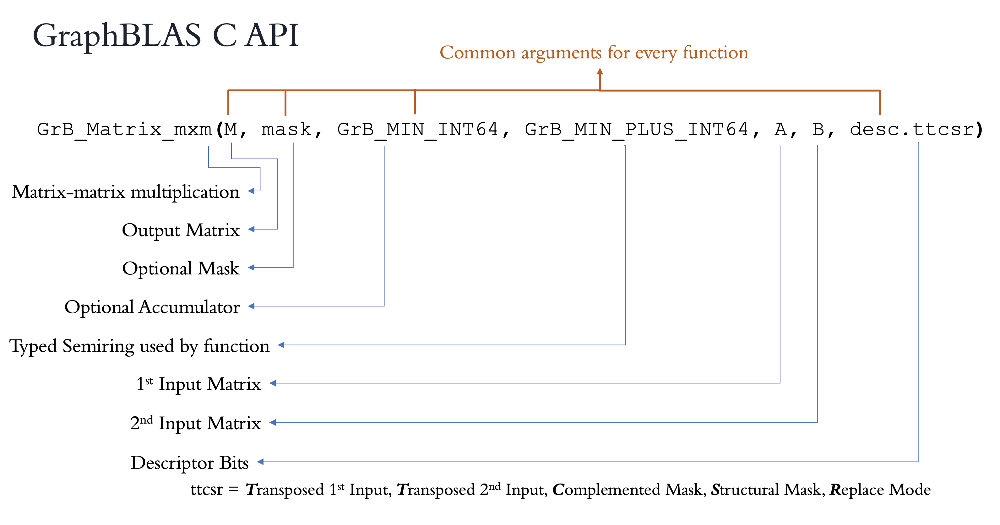
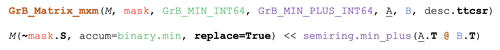

Fundamentals
============

The GraphBLAS specification is a mathematically sound, well thought out API. Most GraphBLAS functions
follow a general pattern as follows:

The name of the function is obviously unique for each function, but in general the output, mask, accumulator,
operator, input arguments, and descriptor are common to every GraphBLAS function.

The **output** is the object which will be updated with the result of the computation. It must already exist
and be initialized, even if initialized as an empty object.

The **mask** is optional and, if defined, controls which elements of the output are updated. Elements outside
the mask are left untouched.

The **accumulator** is optional and, if defined, determines how existing values in the output are combined
with new values from the computation.

The **operator** is the secret sauce in GraphBLAS, allowing matrix multiplication to use a different semiring
than the standard *plus_times*, or to add two vectors together using something other than standard addition.

The **inputs** are the objects involved in the computation. There may be two inputs (for addition or matrix
multiplication) or there may be one input (for apply or reduction).

The descriptor is a set of bitwise flags.

  - The first input can be transposed during the computation (only applies for Matrix input).
  - The second input can be transposed during the computation (only applies for Matrix input).
  - The mask can be complemented, which is needed to avoid situations where only a few elements are
    *not* part of the mask. Rather than creating a mostly dense object, the very sparse mask can be provided
    with a complement indicator.
  - The structure of the mask can be used as the mask, ignoring the values in the mask object. This is more
    efficient than checking each value and essentially treats the mask as if every element were True.
  - Replace mode indicates that elements outside the mask area should be cleared in the final output.
    When not in replace mode, elements outside the mask are left untouched.

For more details, look at the official API spec at `graphblas.org <https://graphblas.org>`_.

C-to-Python Mapping
-------------------

The mapping between the C API and the python-graphblas API is as follows.

All arguments which impact the output are grouped on the left side of the ``<<``.
This includes the output itself as well as the mask, accumulator, and relevant pieces of
the descriptor.

Everything which describes the actual computation (operation, input arguments, operator)
is grouped on the right side of the ``<<``.

This separation is very intentional. While the whole expression is passed as a single call
to the backend GraphBLAS implementation, it really is two operations fused together for
efficiency. The computation on the right could be computed fully and subsequently the output could be
updated with the computed object. This is obviously inefficient when a mask is used and
many of the elements computed on the right would be thrown away. This is the reason to fuse
the two operations for performance. However, keeping them separated in the python-graphblas
notation makes it much easier to see and reason about the two aspects of the fused operation.

The descriptor bit flags are common in C, but with Python we can have a much nicer syntax.
The bit flags become attributes on the objects they impact.

  - For input arguments, adding ``.T`` will indicate that the argument should be transposed in the operation.
  - For the mask, ``.S`` indicates the structure is only considered, while ``.V`` indicates that the value
    of each element should be used.
  - The mask also has a prefix ``~`` to indicate the complement of the mask.
  - Replace mode is indicated with a boolean keyword argument named ``replace``.

Update Notation (<<)
--------------------

With the goal to separate output-affecting items on the left side of an assignment syntax, the obvious choice
would have been to use ``M = ...``.  Unfortunately, in Python this replaces what the variable ``M`` is pointing
to rather than updating ``M``.

.. code-block:: python

    # This doesn't actually update M
    M = semiring.min_plus(A @ B)

Python does have assignment notation using square brackets. While this would work to update ``M``,
the square bracket notation lacks the ability for keyword-arguments. Doing something like this is impossible:

.. code-block:: python

    # This will raise a SyntaxError
    M[mask, accum=binary.min] = semiring.min_plus(A @ B)

To have the full power of keyword arguments, the choice was made to use call syntax (i.e. parentheses) on
the output object. Python does not allow assignment into the result of a function call. However, the
left-shift (<<) operator can work with the result of such a call.

Thus the choice was made to (ab)use the left-shift operator to indicate updates. It satisfies the visual
feeling of computation from the right side flowing to the left. The result of the left-shift operator is
ignored, while the object on the left is updated as a side-effect.

.. code-block:: python

    # This is the preferred syntax for python-graphblas
    M(mask, accum=binary.min) << semiring.min_plus(A @ B)

For anyone who objects to using the left-shift operator this way, an update method exists to perform the
same job.

.. code-block:: python

    # This is equivalent to the code above
    M(mask, accum=binary.min).update(semiring.min_plus(A @ B))

Delayed Objects
---------------

In python-graphblas, most computations result in delayed objects. It is only when both sides are passed in the
update (``<<``) that everything is brought together into a single call to the GraphBLAS backend. This gives
the benefit of nicer Python syntax with very efficient fused GraphBLAS calls for performance.

The user needs to be aware of these delayed objects when inspecting them. The ``__repr__`` is very similar,
but will usually show something like ``MatrixExpression`` to indicate a delayed object. For small objects,
the ``__repr__`` will usually perform the computation to show the user what the result will be. For large objects,
this is not done to avoid an expensive computation during object inspection.

Delayed objects can also be explicitly converted to real objects using the ``.new()`` method.

.. code-block:: python

    # This is a delayed object
    delayed = semiring.min_plus(A @ B)
    # This is now a real object
    real_object = delayed.new()

    # Or make it real in one go
    M = semiring.min_plus(A @ B).new()

In general, delayed objects can be passed as inputs into subsequent computations without problems.

.. code-block:: python

    # C is a delayed object
    C = semiring.min_plus(A @ B)

    # Passing C is okay here; D is still a delayed object
    D = C.reduce_rowwise(monoid.plus)

However, a delayed object cannot be used as the output object without first converting it into a real object.

Functional vs. Method Call Syntax
---------------------------------

Some operations (ex. reduce) only have a method form for calling.

.. code-block:: python

    v << A.reduce_columnwise(monoid.times)

Other operations (ex. assignment) only have a syntax form.

.. code-block:: python

    # Fill the 2nd column of B with all 1's
    B[:, 1] << 1

However, most operations have both a functional and a method-based calling syntax.
For method-based calls, the operator is an argument. For functional calls, the operator
is the calling object.

.. code-block:: python

    # Method form for element-wise intersection
    C << A.ewise_mult(B, binary.plus)

    # Functional form for element-wise intersection
    C << binary.plus(A & B)

Comparing Objects
-----------------

Comparing objects can be tricky because of the need to check the shape, sparsity pattern, and values
of both objects. Two convenience methods exist to simplify comparisons.

1. isequal -- for checking exact matches
2. isclose -- for checking approximately equal for floating point dtypes

By default, the types do not need to match as long as the values are equivalent. If exact dtype matching
is required, set the ``check_dtype`` keyword argument to True.

.. code-block:: python

    while True:
        w = ... # perform some computation
        # Exit the loop once converged
        if v.isclose(w, rel_tol=1e-03):
            break
