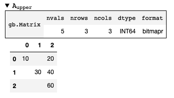
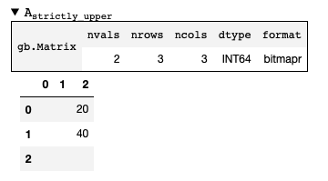

Operators
=========

Operators operate on the individual elements of collections. There are various operator classes in
GraphBLAS, each with defined mathematical properties.

Unary Operators
---------------

Unary operators map one input value to another in a possibly different domain.

Example usage:

.. code-block:: python

    # Compute the absolute value of each element in M
    M_abs = gb.unary.abs(M).new()

Common unary operators are:

  - **identity** -- returns the input unchanged
  - **abs** -- absolute value
  - **ainv** -- additive inverse (f(x) = -x)
  - **minv** -- multiplicative inverse (f(x) = 1/x)
  - **lnot** -- logical not (True -> False)
  - **bnot** -- binary not (110010 -> 001101)
  - **one** -- result is always 1.0 (or equivalent for the dtype)
  - **round** -- floating-point round function
  - **floor** -- floating-point floor function
  - **ceil** -- floating-point ceiling function
  - **sin** -- trigonometric sine function
  - **cos** -- trigonometric cosine function
  - **tan** -- trigonometric tangent function
  - **exp** -- exponential
  - **log** -- logarithm

Unary operators are located in the ``graphblas.unary`` namespace. Additional unary operators
registered from numpy are located in ``graphblas.unary.numpy``.

Binary Operators
----------------

Binary operators take two inputs and return a single value. The input domains and output domain
do not need to match.

Output accumulators are binary operators.

Example usage:

.. code-block:: python

    # Element-wise union, taking the max for intersecting element
    # Accumulate the result into M via addition
    M(accum=gb.binary.plus) << gb.binary.max(A | B)

Common binary operators are:

  - **pair** -- result is always 1.0 (or equivalent for the dtype)
  - **first** -- f(a, b) = a
  - **second** -- f(a, b) = b
  - **min** -- min(a, b)
  - **max** -- max(a, b)
  - **eq** -- a == b
  - **ne** -- a != b
  - **gt** -- a > b
  - **lt** -- a < b
  - **ge** -- a >= b
  - **le** -- a <= b
  - **plus** -- a + b
  - **minus** -- a - b
  - **times** -- a * b
  - **truediv** -- a / b
  - **fmod** -- a % b
  - **pow** -- a ** b
  - **atan2** -- math.atan2(a, b)
  - **lor** -- logical or (a | b)
  - **land** -- logical and (a & b)
  - **lxor** -- logical xor (a ^ b)
  - **lxnor** -- logical xnor ~(a ^ b)
  - **bor** -- binary or
  - **band** -- binary and
  - **bxor** -- binary xor
  - **bxnor** -- binary xnor

Binary operators are located in the ``graphblas.binary`` namespace. Additional binary operators
registered from numpy are located in ``graphblas.binary.numpy``.

Monoids
-------

Monoids extend the concept of a binary operator to require a single domain for all inputs and the output.
Monoids are also associative so the order of operations does not matter
(for example, ``(a + b) + c == a + (b + c)``).
GraphBLAS primarily uses *commutative monoids* (for example, ``a + b == b + a``),
and all standard monoids in python-graphblas commute.
And finally, monoids have a default identity such that ``A op identity == A``.

Monoids are commonly for reductions, collapsing all elements down to a single value.

Example usage:

.. code-block:: python

    # Sum up all non-empty elements in M
    total = M.reduce_scalar(gb.monoid.plus).value

Common monoids are:

  - **any** -- return either input
  - **min** -- min(a, b)
  - **max** -- max(a, b)
  - **plus** -- a + b
  - **times** -- a * b
  - **land** -- a & b
  - **lor** -- a | b
  - **lxor** -- a ^ b
  - **lxnor** -- ~(a ^ b)

Monoids are located in the ``graphblas.monoid`` namespace. Additional monoids registered from
numpy are located in ``graphblas.monoid.numpy``.

Semirings
---------

Semirings are a combination of a monoid and a binary operator. The binary operator is used for the
"multiplication" part of a dot product, while the monoid is used for the reduction.

Standard matrix multiplication uses the "plus_times" semiring.

Semirings are primarily used during matrix multiplication.

Example usage:

.. code-block:: python

    C << gb.semiring.min_plus(A @ B)

Common semirings are:

  - **plus_times** (standard matrix multiplication)
  - **min_plus** (used for shortest path computations)
  - **max_plus**
  - **min_times**
  - **max_times**
  - **min_max**
  - **max_min**
  - **min_first**
  - **min_second**
  - **max_first**
  - **max_second**
  - **plus_min**
  - **lor_land**
  - **land_lor**

Semirings are located in the ``graphblas.semiring`` namespace. Additional semirings registered
from numpy are located in ``graphblas.semiring.numpy``.

IndexUnary Operators
--------------------

A variant of unary operators are indexunary operators. They behave exactly like unary operators,
but the inputs are the value, the index position(s) of that value, and a thunk parameter.

For example, an IndexUnary operator applied to a Matrix would be given the value, row, and column
of each element (plus the thunk). The operator can use all of those pieces to determine an appropriate output.

IndexUnary operators are used primarily in ``select`` to filter based on the index positions.

Example usage:

.. code-block:: python

    # Select the upper triangle
    A_upper = gb.select.triu(A).new(name="A_upper")

Example usage with a thunk parameter:

.. code-block:: python

    # Select the upper triangle, excluding the diagonal
    A_upper = gb.select.triu(A, 1).new(name="A_strictly_upper")

Defined IndexUnary operators are:

  - **index** -- return the vector index
  - **rowindex** -- return the matrix row index
  - **colindex** -- return the matrix column index
  - **diagindex** -- return the matrix diagonal index (i.e. column - row)
  - **tril** -- lower triangle matrix (True if column >= row)
  - **triu** -- upper triangle matrix (True if column <= row)
  - **diag** -- matrix diagonal (True if row == column)
  - **offdiag** -- matrix off-diagonal (True if row != column)
  - **indexle** -- vector index <= thunk
  - **indexgt** -- vector index > thunk
  - **rowle** -- matrix row index <= thunk
  - **rowgt** -- matrix row index > thunk
  - **colle** -- matrix column index <= thunk
  - **colgt** -- matrix column index > thunk
  - **valueeq** -- value == thunk
  - **valuene** -- value != thunk
  - **valuelt** -- value < thunk
  - **valuele** -- value <= thunk
  - **valuegt** -- value > thunk
  - **valuege** -- value >= thunk

IndexUnary operators are located in two places.

  - ``graphblas.indexunary``

    All IndexUnary operators are contained here.
    Calling the operators in the indexunary namespace will perform an ``apply`` operation.

  - ``graphblas.select``

    Only the IndexUnary operators which return a boolean are contained in this namespace
    (i.e. all except rowindex, colindex, and diagindex). Calling the operators in the
    select namespace will perform a ``select`` operation.

Aggregators
-----------

Aggregators are advanced reducers. They are similar to monoids, but do not require the same input
and output domain. They are usually efficiently constructed recipes which require several calls to
the backend GraphBLAS implementation, but are often thought of as a single unit of computation by
other scientific libraries.

For example, ``argmax`` reduces all the elements of a Vector to a single value, but instead of returning
the maximum value, it returns the index of the maximum value. This requires additional work beyond what
a simple monoid can provide.

Example usage:

.. code-block:: python

    pos_of_largest = v.reduce(gb.agg.argmax).value

Common Aggregators are:

  - **count** - the number of non-empty elements
  - **argmax** - position of the largest element
  - **argmin** - position of the smallest element
  - **mean** - average value (i.e. sum / count)
  - **stdp** - population standard deviation
  - **stds** - sample standard deviation
  - **first** - first element
  - **last** - last element

Aggregators are located in the ``graphblas.agg`` namespace.

Calling an aggregator with a collection will perform a reduction to scalar operation.
Specifying ``rowwise=True`` or ``columnwise=True`` allows performing Matrix to
Vector reduction rather than a full reduction to scalar.

Operator Type Specialization
----------------------------

When calls are made to the backend GraphBLAS implementation, all operators are typed, meaning
``min_FP32`` and ``min_INT64`` are different operators according to the backend.
To avoid the user needing to worry about this detail, operator classes figure out the correct
type variant to use automatically based on the input arguments.

If desired, the user may explicitly use the typed variants of operators to force a certain behavior.
Be aware that if the collection types do not match the operator types, the collection elements
will be type cast in the backend using C casting rules.

Example usage:

.. code-block:: python

    # This is the normal way to compute the minimum of a Vector
    minval = v.reduce(gb.monoid.min).value

    # This will force the FP32 version of min to be used, possibly type casting the elements
    minvalFP32 = v.reduce(gb.monoid.min["FP32"]).value

The gb.op Namespace
-------------------

As a convenience when working with operators, a single ``graphblas.op`` namespace exists which
combines all the operators from

  - graphblas.unary
  - graphblas.binary
  - graphblas.monoid
  - graphblas.semiring

This facilitates writing more succinct code such as:

.. code-block:: python

    from graphblas import op

    cur_min(accum=op.min) << op.min_plus(A @ B).reduce_rowwise(op.min)

In the case of name conflicts (ex. binary.min and monoid.min), only one will exist in the the
``graphblas.op`` namespace. However, almost all functions which require a specific kind of
operator have a mechanism to convert from an identically named operator of a different type.

For example, using monoid.min as an accumulator will automatically access binary.min instead.
This means that using the correct name from the ``op`` namespace will almost always "just work".

Infix Notation
--------------

Standard Python infix notation works in python-graphblas, but may have a specific meaning for
each symbol. Each is detailed below.

The following objects will be used to demonstrate the behavior.

.. csv-table:: Vector v
    :class: matrix
    :header: 0,1,2,3,4,5

    1.0,,2.0,3.5,,9.0

.. csv-table:: Vector w
    :class: matrix
    :header: 0,1,2,3,4,5

    7.0,5.2,,3.0,,2.5

Operating with Scalars
~~~~~~~~~~~~~~~~~~~~~~

All infix operators involving a scalar will act only on the non-empty elements of the collection.

For example, ``A + 1`` will have the same number of elements as ``A`` and will not becomes
fully dense. In other words, missing values are *not* treated as ``0 + 1 = 1``. Instead, they are
treated as ``missing + 1 = missing``.

Addition
~~~~~~~~

Addition performs an element-wise union between collections, adding overlapping elements.

.. code-block:: python

    v + w

.. csv-table::
    :class: matrix
    :header: 0,1,2,3,4,5

    8.0,5.2,2.0,6.5,,11.5

Subtraction
~~~~~~~~~~~

Subtraction performs an element-wise union between collections, subtracting overlapping elements
and negating any standalone elements from the right-hand object.

.. code-block:: python

    v - w

.. csv-table::
    :class: matrix
    :header: 0,1,2,3,4,5

    -6.0,-5.2,2.0,0.5,,6.5

Multiplication
~~~~~~~~~~~~~~

Multiplication performs an element-wise intersection between collections, multiplying
overlapping elements.

.. code-block:: python

    v * w

.. csv-table::
    :class: matrix
    :header: 0,1,2,3,4,5

    7.0,,,10.5,,22.5

Division
~~~~~~~~

True Division ( / ) performs an element-wise intersection between collections, dividing overlapping
elements and always results in a floating-point dtype.

  - ``0 / 0 = nan``
  - ``+x / 0 = inf``
  - ``-x / 0 = -inf``

.. code-block:: python

    v / w

.. csv-table::
    :class: matrix
    :header: 0,1,2,3,4,5

    0.142857,,,1.166667,,3.6

Floor Division ( // ) performs an element-wise intersection between collections, performing integer
division on overlapping elements. For floating-point inputs, the result remains floating-point,
but all elements are whole numbers.

Dividing by zero with floor division will raise a ``ZeroDivisionError``.

.. code-block:: python

    v // w

.. csv-table::
    :class: matrix
    :header: 0,1,2,3,4,5

    0.0,,,1.0,,3.0

Modulus
~~~~~~~

Modulus performs an element-wise intersection between collections, computing the remainder
of dividing overlapping elements.

.. code-block:: python

    v % w

.. csv-table::
    :class: matrix
    :header: 0,1,2,3,4,5

    1.0,,,0.5,,1.5

Power
~~~~~

Power performs an element-wise intersection between collections, computing x to
the power of y for overlapping elements.

.. code-block:: python

    v**w

.. csv-table::
    :class: matrix
    :header: 0,1,2,3,4,5

    1.0,,,42.875,,243.0

Comparisons
~~~~~~~~~~~

Comparisons (==, !=, >, >=, <, <=) perform an element-wise intersection between collections,
performing the comparison for overlapping elements. The result is always boolean.

**NOTE:** to compare full equality of two collections, use ``.isequal`` or ``.isclose``
rather than ``all(A == B)``

.. code-block:: python

    v > w

.. csv-table::
    :class: matrix
    :header: 0,1,2,3,4,5

    False,,,True,,True

.. code-block:: python

    v == w

.. csv-table::
    :class: matrix
    :header: 0,1,2,3,4,5

    False,,,False,,False
