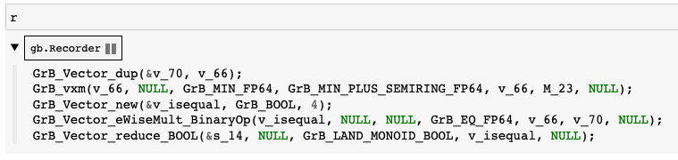

Recorder
========

While python-graphblas dispatches to GraphBLAS C API calls in the backend, many design decisions
have been made which make it easier to write and read python-graphblas code. As a result, it may
not always be obvious exactly how python-graphblas code relates to the backend calls.

A ``Recorder`` object exists which records each of the backend calls, making it easier to see what
calls and how many calls are being made to the backend implementation. This can be used for debugging
as well as for easy porting of python-graphblas algorithms into C if the need arises.

The following example shows the Single-Source Shortest Path algorithm in Python.
Because there is a Python while-loop, the Recorder will be inserted inside the
loop to avoid viewing the calls from every iteration of the loop (which is not very helpful).
Instead, only the calls from the last iteration will be returned.

.. code-block:: python

    from graphblas import op, semiring, Matrix, Vector, Recorder

    # Create the graph and starting vector
    start_node = 0
    G = Matrix.from_coo(
        [0, 0, 1, 1, 2],
        [1, 2, 2, 3, 3],
        [2.0, 5.0, 1.5, 4.25, 0.5],
        nrows=4,
        ncols=4
    )
    v = Vector.from_coo([start_node], [0.0], size=4)

    # Compute SSSP
    while True:
        # Place the recorder inside to loop to only get one-loop worth of calls
        with Recorder() as r:
            w = v.dup()
            v(op.min) << semiring.min_plus(v @ G)
            if v.isequal(w):
                break

To explain the result,

  - v.dup() became a single ``GrB_Vector_dup`` call
  - The min_plus matrix multiplication became a single ``GrB_vxm`` call
  - isequal is a recipe and became 3 lines of backend calls

    - ``GrB_Vector_new`` to create a temporary object
    - ``GrB_Vector_eWiseMult_BinaryOp`` using the ``EQ`` operator
    - ``GrB_Vector_reduce_BOOL`` using the ``LAND`` (logical and) operator to reduce

The names of the several objects (v_70, v66, s_14) are obviously random, but with these lines,
it should be very simple to write an equivalent SSSP algorithm using a C while-loop and C API calls.
